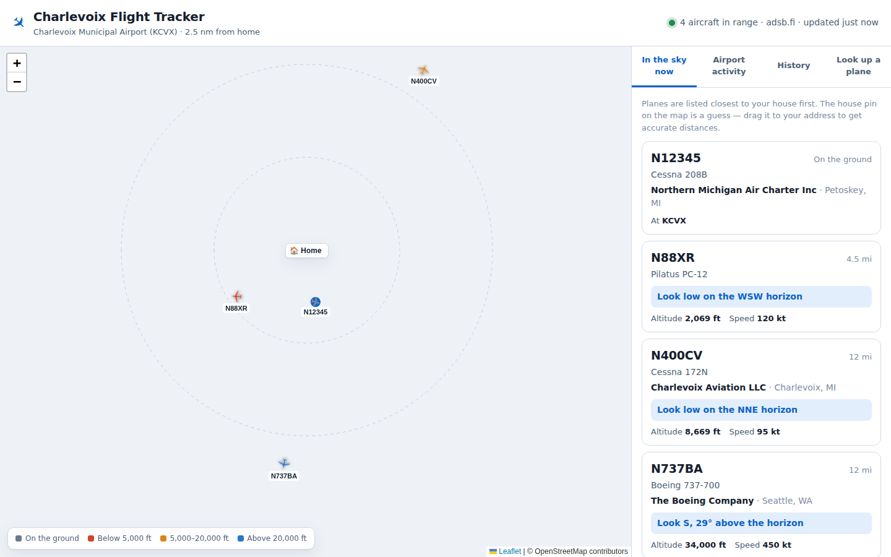

# Charlevoix Flight Tracker

A small website that shows what is flying around **Charlevoix Municipal Airport
(KCVX)** — live positions on a map, a log of every takeoff and landing, and the
registered owner of each aircraft.

It runs on your own computer. Nothing is sent anywhere, and there is no account
to make.



---

## Start here

You need [Node.js](https://nodejs.org) installed (the big green "LTS" download
button), version 20 or newer. Then open Terminal and run these three lines one
at a time:

```bash
cd charlevoix-flight-tracker
npm install
npm start
```

Your browser opens by itself at **http://localhost:4903**. If it does not, type that address in yourself.

Leave the Terminal window open — that is the tracker running. To stop it, click
the Terminal window and press `Control` + `C`.

### One more step, to see who owns the planes

The owner names come from the FAA's public aircraft register. Download it once:

```bash
npm run import-registry
```

It is about a 90 MB download and takes a couple of minutes. After that, owner
lookups work offline. Re-run it every month or two to pick up new
registrations.

### Set your house

The map opens with a **🏠 Home** pin at an approximate spot on Lake Shore Drive.
**Drag it to your actual house** and let go — it saves straight away. Every
distance and "look this way" hint is measured from that pin, so it is worth
getting right.

---

## What each part of the site does

**In the sky now** — every aircraft currently in range, closest to your house
first. Each one tells you where to look:

> **Look NNW, 23° above the horizon**

NNW is the compass direction. 23° above the horizon is roughly a quarter of the
way up the sky (straight ahead is 0°, straight up is 90°).

**Airport activity** — a running log of takeoffs and landings at KCVX, with the
aircraft type and its registered owner. Filter by day or by type.

**History** — daily activity for the last two weeks, plus the aircraft that use
the field most often.

**Look up a plane** — search the FAA register by tail number (like `N400CV`) or
by owner name.

Click any aircraft, anywhere, for the full record: owner, owner type, year
built, engine, seats, serial number, registration status, and every movement
the tracker has logged for it.

### "Took off" vs "Probable"

A small airport has no control tower and publishes no schedule, so takeoffs and
landings are worked out from how each aircraft moves.

- **No badge** — the aircraft was tracked on the ground at the field, so the
  takeoff or landing is certain.
- **PROBABLE** — the aircraft dropped off the receivers on final approach, or
  appeared already climbing away. Almost always right, but inferred.

Ground-level radio coverage at a small field is patchy, so "probable" is
common and normal.

---

## What it cannot see

Worth knowing so the log is not misread:

- **Aircraft without ADS-B.** The tracker listens to ADS-B, the position signal
  most aircraft broadcast. KCVX sits in airspace where ADS-B is not legally
  required, so some older light aircraft carry none and will never appear.
- **Low-level coverage.** These feeds come from volunteer ground receivers.
  Signals from aircraft on or near the runway are often blocked by terrain, so
  an aircraft can vanish on short final and reappear only once it is high again.
- **Aircraft that ask to be hidden.** Owners can enrol in the FAA's LADD and
  Privacy ICAO Address programmes, which remove their aircraft from public
  feeds or rotate their identifier.
- **Who is actually on board.** The register names the *registered owner*, which
  is very often a bank, a trust, or an LLC that exists to hold the aircraft. It
  does not tell you who chartered or is flying it.
- **A schedule.** There is no published schedule for a non-towered general
  aviation field. This shows what *has happened* and what is happening now.

The FAA also lets owners ask for their name and address to be withheld from the
public register, so a few aircraft will show no owner at all.

---

## Leaving it running

The log only fills in while the tracker is running. Two easy options:

- **Just leave it open.** Keep the Terminal window running on a computer that
  stays on. Closing the laptop lid will pause it.
- **Run it on a small always-on machine** — a Raspberry Pi or an old laptop in
  a closet works well. Then open `http://<that-machine>:4903` from anywhere in
  the house.

To reach it from a phone or tablet on the same wi-fi, find the computer's local
IP address and use `http://192.168.x.x:4903`.

---

## Settings

Everything is optional. Create a `config.json` next to `package.json` to change
any of these — anything you leave out keeps its default:

```json
{
  "home": { "lat": 45.3452, "lon": -85.2848, "elevationFt": 620 },
  "radiusNm": 40,
  "pollSeconds": 15,
  "port": 4903
}
```

| Setting | Default | What it does |
| --- | --- | --- |
| `home` | Lake Shore Drive (approx.) | Where distances and viewing directions are measured from. Easier to set by dragging the map pin. |
| `airport` | KCVX | The field to watch for takeoffs and landings. |
| `radiusNm` | `40` | How far out to watch, in nautical miles. |
| `pollSeconds` | `15` | Seconds between checks of the live feed. Do not go below 5 — the feeds are free and rate-limited. |
| `retainSightingDays` | `60` | How long detailed sightings are kept. Takeoff/landing events are kept forever. |
| `port` | `4903` | The port the site is served on. |
| `timezone` | `America/Detroit` | Used for "today" and the daily chart. |

Set `PORT=8080 npm start` to override the port for one run.

### Where your data lives

- `data/flights.db` — the flight log and the FAA register. Delete it to start
  over; the tracker rebuilds it.
- `config.json` — your settings. Neither file is committed to git.

---

## Commands

| Command | What it does |
| --- | --- |
| `npm start` | Run the tracker and the website, and open it in your browser. |
| `npm start -- --no-open` | Same, without opening a browser (for a headless machine). |
| `npm run demo` | Run with invented aircraft — useful for a look around with no live data. |
| `npm run import-registry` | Download and import the FAA aircraft register. |
| `npm run import-registry -- <file>` | Import a `ReleasableAircraft.zip` you already downloaded. |
| `npm test` | Run the test suite. |

---

## If something is not right

**"command not found: npm"** — Node.js is not installed. Get it from
[nodejs.org](https://nodejs.org) and try again.

**`npm install` prints errors about `better-sqlite3`, `node-gyp` or `climits`**
— harmless. That package is optional: it is a faster database driver that has
to be compiled, and compiling needs developer tools installed. When it is not
available the tracker uses the SQLite built into Node instead. The startup
banner shows which one it picked. Everything works either way.

**`npm error EACCES` mentioning `.npm/_cacache`** — an old npm bug left
root-owned files in your cache. npm prints the fix; on a Mac it is
`sudo chown -R $(id -u):$(id -g) ~/.npm`, then run `npm install` again.

**The page says "Live data unavailable"** — the feeds are volunteer-run and go
down sometimes. The tracker retries automatically and tries a different source
each time. Check your internet connection first.

**No planes at all, but the status looks fine** — Charlevoix is genuinely quiet,
especially outside summer and after dark. Widen `radiusNm` to confirm the feed
is working.

**Owner names are missing** — run `npm run import-registry`. If the download is
blocked, fetch
<https://registry.faa.gov/database/ReleasableAircraft.zip> in a browser and run
`npm run import-registry -- ~/Downloads/ReleasableAircraft.zip`.

**Something is on port 4903 already** — run `PORT=5000 npm start` and use
`http://localhost:5000`.

---

## Where the data comes from

| Source | Used for |
| --- | --- |
| [adsb.fi](https://adsb.fi), [adsb.lol](https://adsb.lol), [airplanes.live](https://airplanes.live) | Live aircraft positions. Tried in order; the first to answer wins. |
| [FAA Aircraft Registry](https://registry.faa.gov/aircraftinquiry/) | Owner, model, year, engine, seats. |
| [OpenStreetMap](https://openstreetmap.org) | Map tiles. |

The live feeds are free and volunteer-run. Please do not lower `pollSeconds`
below 5 seconds.

## How it works

```
ADS-B feed  ──▶  tracker.js  ──▶  SQLite  ──▶  /api/*  ──▶  the page
 positions      takeoff and       log and      JSON       map + lists
                landing logic     register
```

- `server/adsb.js` — talks to the position feeds, falls back between them, and
  normalises the results.
- `server/tracker.js` — decides what each aircraft is doing. Ground-to-air near
  the field is a takeoff, air-to-ground is a landing, and tracks that cut out
  low on approach are recorded as probable.
- `server/nnumber.js` — converts between ICAO addresses and N-numbers, so an
  aircraft can be identified even when the feed sends no registration.
- `server/faa.js` — imports and queries the FAA register.
- `public/` — the site. Plain HTML, CSS and JavaScript; no build step.

MIT licensed. Built for one house on Lake Shore Drive.
